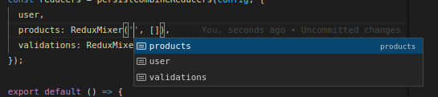

# react-redux-mixer

a tool to reduce your code, especially your reducers

forget switches and types in your reducers, declare just the name, and the initial state, and follow the event pattern

## usage

simpler than any other

- src/reducers/store.js

``` js
    import { createStore, combineReducers } from 'redux';
    import { ReduxMixer } from 'react-redux-mixer';
    import { user } from './reducer';

    const rootReducer = combineReducers({
        user,
        products: ReduxMixer('products', []),
        validations: ReduxMixer('validations', [], 'uuid'),
    });

    const store = createStore(rootReducer);

    export default store;
```

### optional

- src/typings/root.d.ts

this will make vs intellicode give good suggestions when typing

``` ts
import { User, Product, Validation } from './models'

  declare module 'react-redux' {
    export interface DefaultRootState {
        user: User,
        products: Product[],
        validations: Validation[],
    }
}

```


## standardized CRUD

use the entity with the name in the mixer

 - default types

 ``` php
    ├── ${value}:mount // change the whole state for a new one
    ├── ${value}:create // unshift an object into
    ├── ${value}:will:update // takes an "updating" property: boolean
    ├── ${value}:update // update properties by fk
    ├── ${value}:will:delete // takes an "deleting" property: boolean
    └── ${value}:delete // delete object by fk
```

## tools
Mutate a copy of data without changing the original source
this package uses [immutability-helper](https://github.com/kolodny/immutability-helper)